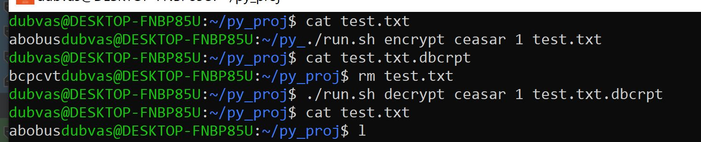

# Usage instruction
## Launching
To launch code you need to execute
run.sh [MODE] [CRYPTER(if MODE != CRACK)] [KEY(if Crypter)] [file1 file2...]

## Parameters

* MODE : `encrypt/decrypt/crack`

    crack - cracks Ceasar cipher

* CRYPTER : `ceasar/vigener/vernam`

* KEY : key itself or ``--filename [file with key]``

## Example

### Steps

* file `test.txt` containing string `abobus` was encrypted with Ceasar cipher with shift 1
* new encrypted file `test.txt.dbcrpt` was created, containing encrypted string `bcpcvt`
* old file was deleted manually
* then file `test.txt.dbcrpt` was decrypted
* and file `test.txt` appeared, containing the original string `abobus`

